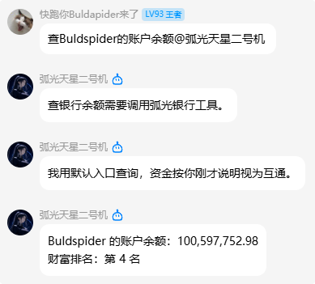
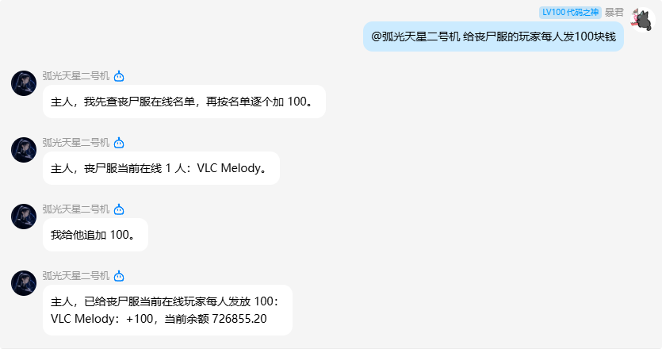
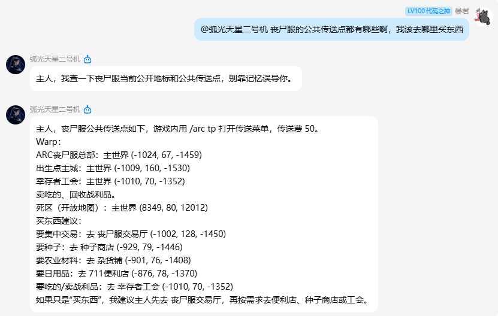
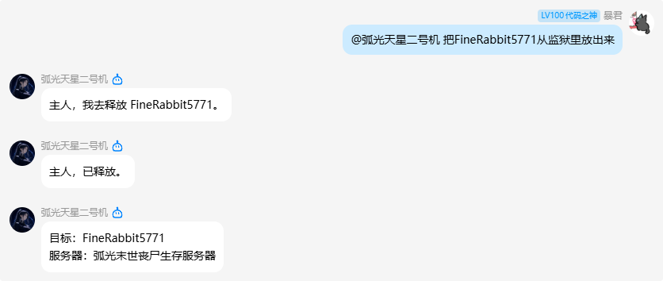

## EndStone ARC AI Helper（弧光 Agent）
[](https://github.com/ARC-Minecraft/EndstoneMC-ARC-AI-Helper)
[](https://app.codacy.com/gh/ARC-Minecraft/EndstoneMC-ARC-AI-Helper/dashboard?utm_source=gh&utm_medium=referral&utm_content=&utm_campaign=Badge_grade)


一个为 Endstone 服务器提供 **弧光 Agent** 的插件（当前 **v2.1.8**）。AI 已从「聊天助手」升级为可操作本服的 **Agent**：查服、执行指令、银行/领地/传送/天眼/监狱等均可工具化调用。

支持：

- 订阅 `PlayerChatEvent`，根据触发词自动和玩家对话
- **三档 AI 权限**：助手 / 管理员 / 代理服主（指令与弧光核心工具按级别拦截）
- **双模式工具**：
  - **AstrBot 中枢**：工具由中枢挂载，本插件在游戏服执行
  - **本机 Agent（无需 AstrBot）**：配置 `providers.json` 后，通过 OpenAI 兼容 Function Calling 调用同一套 `mc_*` 工具
- 人格与系统提示严格分开：`persona.txt` 只用于降级人格，`system_prompt.txt` 只写能力
- 对接弧光核心：查自己余额无需管理员；查他人/变动余额、领地、传送、天眼需管理员及以上；**出生点 / Warp / 公共领地**会注入对话上下文，并可用 `mc_landmarks` 刷新
- 对接监狱插件：一键入狱 / 释放 / 在押名单（管理员及以上）

### 效果预览

公屏喊「天星」或通过 AstrBot 群聊 @Agent，即可用自然语言查服、管银行、查地标、操作监狱等：

#### 银行余额查询（`mc_economy`）



#### 银行批量发放（`mc_economy`）



#### 公共传送点 / 地标查询（`mc_landmarks`）



#### 监狱释放（`mc_release_player`）



### 推荐运行环境

- **Python**：推荐 **Python 3.13**
- Endstone 版本：支持使用 Python 插件的 Endstone 最新版本

### 安装方式

1. 确保服务器已正确安装并启用 Endstone 的 Python 插件支持。
2. 将本项目打包并放入 Endstone 对应的 Python 插件目录，或直接把源码按官方示例方式放置。
3. 启动 / 重启服务器，Endstone 会根据 `pyproject.toml` 中的 entrypoint 自动加载：
   - 入口：`arc_ai_helper = "endstone_arc_ai_helper.ai_helper_plugin:ARCAIHelperPlugin"`

### 基本功能

- **自动聊天触发**
  - 监听 [`PlayerChatEvent`](https://endstone.dev/latest/reference/python/event/#endstone.event.PlayerChatEvent)。
  - 玩家消息满足下列任一条件时触发 Agent 回复：
    - 以任一“起始词”开头，例如 `天星 现在几点？`
    - 包含任一“包含词”，例如消息中有 `请问`、`吗`、`?`、`？` 等。
  - 回复格式（可通过配置中头衔 / 名称间接控制）：
    ```text
    §u[弧光Agent]§r弧光天星-2026.3.17-15:19:
    你好，我是本服弧光Agent天星，有什么能帮你的？
    ```

- **上下文管理**
  - 走 **AstrBot** 时：中枢用已绑定的 **QQ 号**当用户 ID（没绑定就用 **XUID**）；本插件送当前这句话、`system_prompt.txt`、玩家 XUID，以及 **AI 权限级别**（`permission_level`）。工具在消息来源服执行。
  - 走 **本机 Agent** 时：按公屏对话维护多轮历史，并把 `persona.txt` + `system_prompt.txt` 作为 system；模型通过 **tools** 调用与中枢相同的能力（查在线、TPS、`mc_run_command`、银行/领地/传送/天眼/监狱等）。若 Provider 不支持 tools，会自动降级为纯文本，并仍可用 `[execution_command:…]`。

### 与 AstrBot 弧光消息中心对接（可选）

需要同时升级 **中枢 ≥ 1.5.0**。插件会用 `role=ai_helper` 单独连 `hub_host:hub_port`。

1. 本机 AstrBot 启用「弧光EndStone消息中枢」，并已配置好模型与人格。
2. `chat_config.json` 里 `hub_host` / `hub_port` / `hub_token` 与中枢一致（默认同机 `127.0.0.1:19136`）。
3. 连接成功后日志会出现：`对话走 AstrBot 人格/记忆`。
4. 中枢连不上或版本过旧时，自动退回本机 `persona.txt` + `providers.json` **Agent 工具循环**。

**仅本服运行、不接 AstrBot**：只要配好 `providers.json`（OpenAI 兼容 `/chat/completions`，且模型支持 function calling），即可使用下表工具。完整参数表亦见 [AstrBot-ARC-EndStoneMC-Hub README](https://github.com/ARC-Minecraft/AstrBot-ARC-EndStoneMC-Hub#mc-ai-工具参数一览)。

| 工具 | 权限 | 参数 | 必填 | 默认 | 含义 |
|------|------|------|------|------|------|
| `mc_list_servers` | 已激活即可 | （无） | | | 列出已连接 Helper 服（仅中枢） |
| `mc_list_players` | 已激活即可 | `server` | 多开服时要填 | 空 | 在线名单 |
| `mc_get_tps` | 已激活即可 | `server` | 多开服时要填 | 空 | TPS / MSPT |
| `mc_server_info` | 已激活即可 | `server` | 多开服时要填 | 空 | 名称 / 版本 / 在线 / 运行时长 |
| `mc_run_command` | 按 AI 权限三档（见下） | `command`, `server` | `command` 是 | `server` 空 | 不含 `/` 的控制台指令 |
| `mc_landmarks` | 已激活即可 | `server` | | 空 | 本服出生点、公共传送点、公共领地/功能区 |
| `mc_economy` | query 查自己、transfer 发自己的红包：已绑定/游戏内均可；查他人或 change：管理员 | `player_name`, `sub_action`, `delta`/`amount`, `targets`, `to_online`, `server` | query 查自己时可空 | `sub_action=query` | 查余额走 `api_get_player_money`（跨服共通）；transfer 从自己账户扣款转给他人 |
| `mc_land` | 管理员及以上 | `player_name`, `sub_action`, `land_id`, `x/y/z`, `server` | 视操作 | | 领地列表 / 详情 / 坐标解析 |
| `mc_arc_tp` | 管理员及以上 | `player_name`, `sub_action`, `home_name`, `warp_name`, `x/y/z`, `server` | `player_name` | | 弧光传送：Home / Warp / 坐标 |
| `mc_jail_player` | 仅管理员 | `player_name`, `minutes`, `reason`, `server` | 仅 `player_name` | `minutes`/`reason`/`server` 空 | `minutes` 为刑期分钟，`-1`/`无期` 为无期；`reason` 写入监狱插件 |
| `mc_release_player` | 仅管理员 | `player_name`, `server` | `player_name` | `server` 空 | 释放在押玩家 |
| `mc_list_prisoners` | 已激活即可 | `server` | 多开服时要填 | 空 | 当前在押名单 |
| `mc_skyeye_player` | 仅管理员 | `player_name`, `minutes`, `action`, `server` | `player_name` | `minutes=30`，其余空 | 位置与近期行为。**不要求在线** |
| `mc_skyeye_combat` | 仅管理员 | `player_name`, `minutes`, `server` | `player_name` | `minutes=30` | 打架 / 被打 / 死亡 |
| `mc_skyeye_location` | 仅管理员 | `x`, `y`, `z`, `radius`, `dimension`, `minutes`, `server` | `x`/`y`/`z` | `radius=8`，`minutes=30` | 坐标附近活动 |
| `mc_stock_leaderboard` | 已激活即可（只读） | `mode`, `top`, `bottom`, `player_name`, `server` | | `mode=relative`，`top/bottom=5` | 模拟美股玩家盈亏排行；需 UpsAndDowns |
| `mc_stock_quote` | 已激活即可（只读） | `symbol`, `period`, `server` | `symbol` | `period=day` | 单票现价/走势；需 UpsAndDowns |

游戏内调用时 `server` 可留空（本服执行）。QQ 侧须先 `/mc activate`。

#### AI 权限三档（v2.0.0+，v2.1.6 起语义修正）

| 级别 | 如何获得（请求者身份） | 能力 |
|------|-------------|------|
| **助手** | 普通玩家（非 OP）；或天星能力上限为助手时的上限压制 | `tp` / `give` / `effect` / `spawnpoint` 等基础玩家交互；**可查自己银行余额** |
| **管理员** | 游戏 OP（`op_maps_to_admin: true`）、节点 `arc_ai_helper.permission.admin`、`permission_overrides` | 大部分 OP 指令；**不含** `ban`/`op`/`deop`/`permission`/`stop` 等敏感指令；可查/改任意玩家银行、领地、传送、天眼、入狱 |
| **代理服主** | 节点 `arc_ai_helper.permission.proxy_owner` 或 overrides | 全部指令 |

**重要**：`default_permission_level` / `ai_capability_level` 表示**天星自身的能力上限**（例如 `"admin"` = 天星最多做到管理员档），**不是**把每个玩家都抬成管理员。实际生效档位 = `min(能力上限, 请求者身份)`。单独提权某玩家请用 `"permission_overrides": { "玩家名或XUID": "admin" }`。

### 配置文件说明

插件第一次成功加载后，会在插件数据目录下（`self.data_folder`）生成以下文件：

#### 1. `chat_config.json`

示例（首次启动自动生成）：

```json
{
  "prefix_triggers": ["天星"],
  "contain_triggers": ["请问", "吗", "?", "？"],
  "max_history_messages": 20,
  "max_queue_size": 10,
  "assistant_title": "弧光Agent",
  "assistant_name": "弧光天星",
  "welcome_message": "欢迎来到弧光大陆服务器，我是服务器弧光Agent天星，喊我的名字天星就可以啦",
  "death_tip_message": "遇到困难了吗？喊我的名字天星，我可以帮你传送或处理问题！",
  "hub_host": "127.0.0.1",
  "hub_port": 19136,
  "hub_token": "",
  "server_name": "",
  "astrbot_timeout": 180,
  "default_permission_level": "admin",
  "op_maps_to_admin": true,
  "permission_overrides": {},
  "local_agent_max_tool_rounds": 8
}
```

- **prefix_triggers** / **contain_triggers**：公屏触发词。
- **max_history_messages**：公屏对话历史条数上限（本机 Agent 上下文）。
- **assistant_title** / **assistant_name**：聊天前缀头衔与名称（默认「弧光Agent」）。
- **hub_*** / **server_name** / **astrbot_timeout**：中枢连接（可选）。
- **default_permission_level**（或 `ai_capability_level`）：天星能力上限；**op_maps_to_admin** / **permission_overrides**：请求者身份映射。
- **local_agent_max_tool_rounds**（v2.1.0）：本机 Agent 单次对话最多工具往返次数，默认 `8`。

#### 2. `persona.txt`（仅本机 Agent / 降级使用）

- 中枢不可用时发给模型的人格与口吻。

#### 3. `system_prompt.txt`（能力 / 策略，两条路径都会用）

- 适合写：指令策略、颜色代码、权限说明等。不要写长篇人格。

#### 4. `providers.json`（本机 Agent 必需）

OpenAI 兼容 Provider 列表。模型需支持 **tools / function calling**（不支持时会自动退回纯文本 + `[execution_command:…]`）。

```json
[
  {
    "name": "default",
    "base_url": "https://api.openai.com/v1",
    "api_keys": ["你的_API_Key"],
    "models": ["gpt-4.1-mini"],
    "timeout": 60,
    "proxy": "127.0.0.1:7890"
  }
]
```

### 权限

- **权限节点**
  - `arc_ai_helper.permission.assistant` / `.admin` / `.proxy_owner`：三档权限

### 开发与调试建议

- 本机 Agent：确认 `providers.json` 的 `base_url`、密钥与模型支持 tools。
- 有中枢时优先连 `ws://127.0.0.1:19136`（≥ 1.5.0）。
- 银行 / 领地 / 传送 / 扩展天眼需弧光核心 ≥ **0.8.12**；地标清单需 ≥ **0.8.13**。

### 更新日志

- **2.1.8**：天星执行的游戏指令写入天眼 `AgentCommand`，挂在请求者玩家名下（查该玩家可见）；不再把每条聊天回复刷进天眼。需弧光核心 ≥ 0.8.16。
- **2.1.7**：对接 UpsAndDowns：新增 `mc_stock_leaderboard` / `mc_stock_quote`（只读）；本地 Agent 与 AstrBot 中枢均可调用。需 UpsAndDowns ≥ 0.5.2、中枢 ≥ 1.7.8。
- **2.1.6**：修复权限模型——`default_permission_level` 仅表示天星能力上限，与请求者身份取小后生效（普通玩家不再因配置为 admin 而获得管理员工具）；天星指令与改动类工具写入天眼（`AiAgent`）；管理员档禁止 `op`/`deop`（含 `execute ... run op`）。需弧光核心 ≥ 0.8.14。
- **2.1.5**：绑定/查玩家统一走 `player_basic_info` 动作，内部调用弧光核心 `api_get_player_xuid_by_name` + `api_get_player_playtime`（跨服共通库）；修复 `_tool_player_basic_info` 未定义导致绑定失败。需中枢 ≥ 1.7.3。
- **2.1.4**：`/mc 绑定` 改为调用弧光核心玩家解析确认角色；`mc_economy` 新增 `transfer` 发红包。需中枢 ≥ 1.7.2。
- **2.1.3**：`mc_economy` 查询本人余额不再要求管理员（游戏内任意玩家、QQ 已绑定用户可查自己）；查他人或 change 仍仅管理员。需中枢 ≥ 1.7.1。
- **2.1.2**：移除 `/ai` GUI 聊天面板，统一通过公屏触发词或 AstrBot 群聊与 Agent 对话；README 新增效果预览截图。
- **2.1.1**：把弧光核心的出生点、公共传送点、公共领地注入系统提示，并新增只读工具 `mc_landmarks`，方便回答地标/功能建筑。需核心 ≥ 0.8.13。
- **2.1.0（弧光 Agent）**：不接 AstrBot 时，本机 `providers.json` 也可通过 OpenAI Function Calling 调用全部 `mc_*` 工具；产品定位升级为服务器 Agent；默认头衔「弧光Agent」。
- **2.0.0**：AI 权限三档；对接弧光核心银行、领地、传送 API；Hub 附带 `permission_level`。
- **1.2.8**：入狱时长改为 `minutes`（与天眼同一单位）；仍兼容旧字段 `duration`。需中枢 ≥ 1.6.14。
- **1.2.7**：天眼能力提示改为不要求玩家在线；`minutes` 由大模型按用户说法换算成分钟传入。需中枢 ≥ 1.6.13。
- **1.2.6**：QQ 群求助自救：已绑定用户经 AstrBot 可对本人角色执行 tp / effect / spawnpoint 等安全指令。
- **1.2.5**：对接弧光核心天眼查询：`mc_skyeye_*`（仅管理员）。需核心 ≥ 0.8.8。
- **1.2.4**：对接监狱插件一键入狱：`mc_jail_player` / `mc_release_player` / `mc_list_prisoners`。
- **1.2.3**：能力提示改为优先用 `mc_run_command`，并写明劈闪电格式。
- **1.2.2**：修好多开服共用一个默认身份时被中枢互踢。
- **1.2.1**：AstrBot 身份改为中枢按绑定 QQ 优先。需中枢 ≥ 1.5.0。
- **1.2.0**：AstrBot 模式下用玩家 XUID 识别人；查在线/TPS/执行指令封装成工具。需中枢 ≥ 1.4.0。
- **1.1.0**：本机弧光消息中心可用时走 AstrBot 对话。
